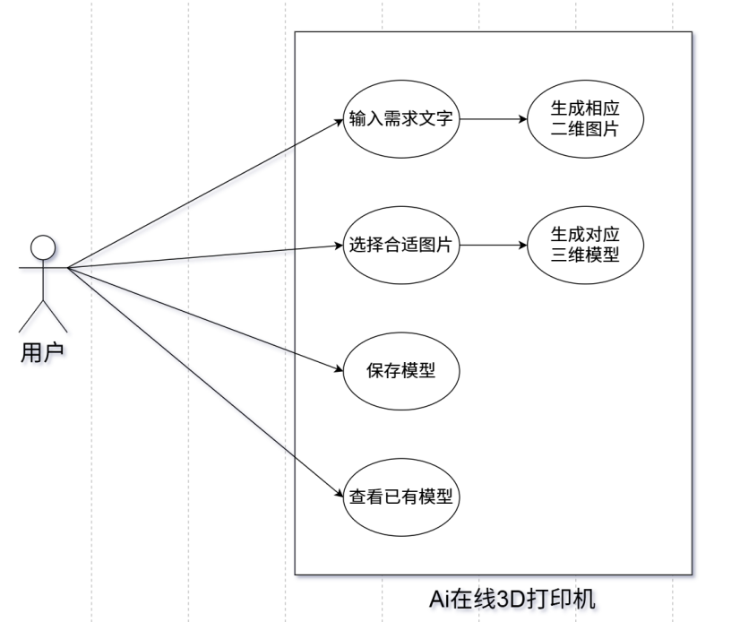

1. 总体业务描述  
在XR开发、游戏制作、具身智能仿真等数字媒体领域，高精度3D资产生成存在流程复杂、耗时久、技术门槛高的问题。本系统基于豆包3D生成模型（Model ID：doubao-seed3d-1-0-250928），开发一款“在线3D打印机”智能应用。支持用户输入文本描述产品形态以生成多张产品图片，随后用户可选择一张最满意的图，让应用快速生成含PBR材质、可自定义多边形面数与格式的3D文件，解决传统3D建模效率低、适配性差的痛点，满足不同场景下3D资产快速构建需求。

2. 功能性分析  
  
用例1：根据用户输入的需求文字生成一张或多张图片。  
用例2：根据用户选择的图片能够生成对应的三维模型。  
用例3：将生成的模型保存到本地。  
用例4：查看过往生成的模型。

系统使用Electron构建。总体上分三层，最上层是UI层 使用Vue3+Ant Design搭建，中间层是Electron核心层，负责处理上面UI渲染层传下来的进程间通信，调用API并返回给渲染层，最下面是火山引擎。