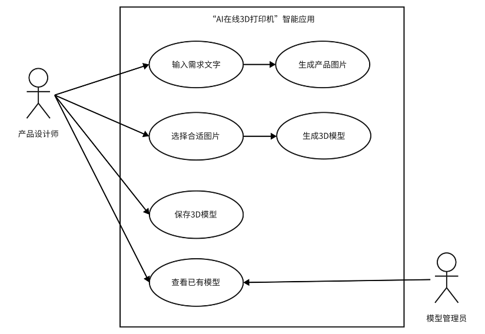
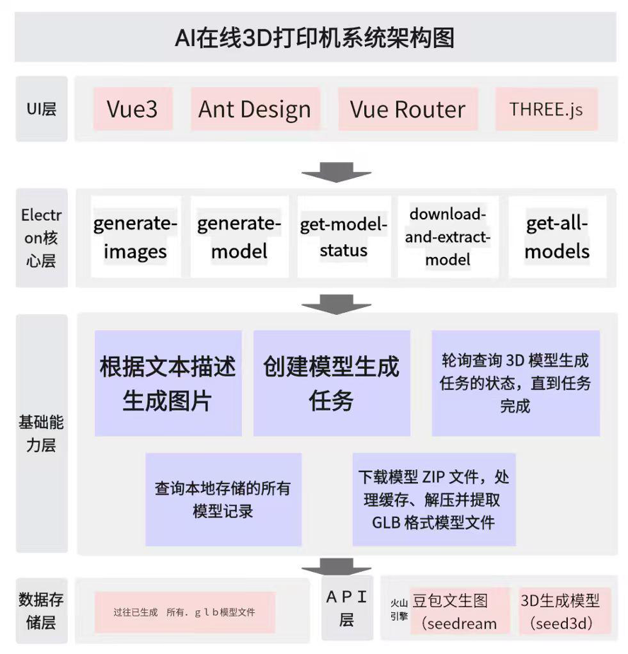
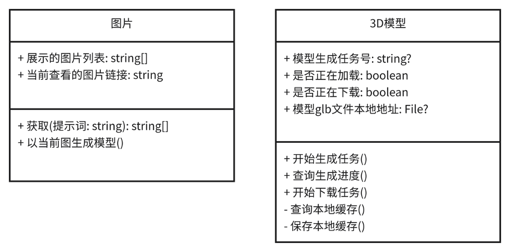
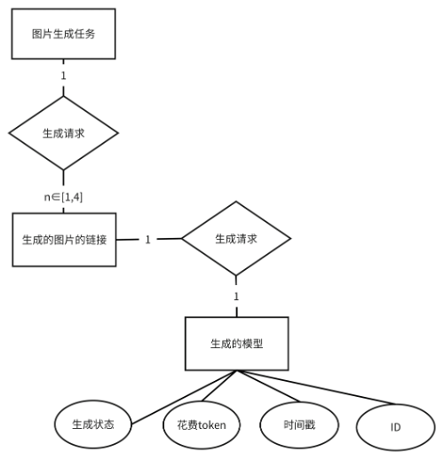
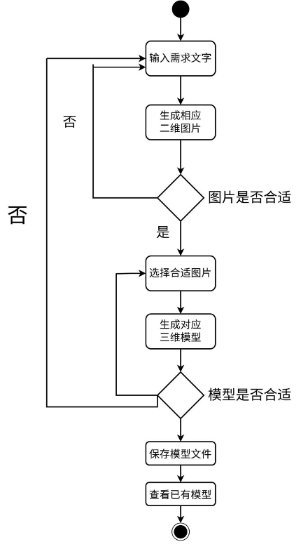

# 一、系统需求分析
## 总体业务描述  
在XR开发、游戏制作、具身智能仿真等数字媒体领域，高精度3D资产生成存在流程复杂、耗时久、技术门槛高的问题。本系统基于豆包文生图（Model ID：doubao-seedream-4-0-250828）以及3D生成模型（Model ID：doubao-seed3d-1-0-250928），开发一款“在线3D打印机”智能应用。支持用户输入文本描述产品形态以生成多张产品图片，随后用户可选择一张最满意的图，让应用快速生成含PBR材质的3D文件，解决传统3D建模效率低、适配性差的痛点，满足不同场景下3D资产快速构建需求。  


## 功能性分析  


**用例1：根据用户输入的需求文字生成一张或多张图片。**

|行为者	|产品设计师、生图模块|
|--|--|
|描述	|用户在应用中的生成图片板块输入关于自己设想的产品的描述，该段文字将作为豆包API的输入，点击生成图片按钮，等待几秒之后，生成一张或者多张图片|
|数据	|需求信息，生成图片的张数|
|刺激	|用户点击生成图片按钮|
|响应	|应用右侧显示出豆包API返回的图片|
评价	|用户必须写入文字并选择生成张数之后才能进行|

**用例2：根据用户选择的图片能够生成对应的三维模型。**

|行为者	|产品设计师、模型生成模块|
|--|--|
|描述	|用户选择图片后，点击开始生成模型，等待几秒之后，生成一个3D模型|
|数据	|用户选择的图片|
|刺激	|用户发出的指令|
|响应	|3D模型生成成功|
评价	|用户必须选择一个图片之后才能进行|

**用例3：将生成的模型保存到本地。**

|行为者	|火山引擎API、模型生成模块|
|--|--|
|描述	|程序在轮询得到远程API的3D模型生成结束之后，会自动下载3D模型到本地，并向用户发送通知|
|数据	|包含glb格式3D模型的zip压缩包|
|刺激	|远程API返回3D模型生成成功（succeed）结果|
|响应	|3D模型保存至应用缓存目录下|
评价	|用户必须选择一个图片之后才能进行|

**用例4：查看过往生成的模型。**

|行为者	|3D模型管理员、模型管理模块|
|--|--|
|描述	|用户点击模型管理之后，会看到生成的所有3D模型|
|数据	|模型的URL下载地址、缓存的键、本地ZIP文件位置、缓存时的时间戳|
|刺激	|用户切换到模型管理页面|
|响应	|显示生成的模型|
评价	|用户必须先生成模型才能查看|

## 非功能分析
**性能需求**：任务创建响应时间≤1秒；3D生成耗时符合模型预期（3-10分钟，复杂图像不超过15分钟）；支持并发任务数≤5（匹配模型并发限制），RPM（每分钟请求数）≤300。

**安全性需求**：API Key采用加密存储（本地配置文件加密/环境变量注入）；任务数据（含图像URL、3D文件URL）仅保留24小时（遵循模型数据保存规则），超时自动清理。

**易用性需求**：提供可视化参数配置界面（下拉选择图片批量）；任务状态实时推送（在检测到远程API生成任务成功后发送系统通知提示用户）；在3D模型展示页展示坐标轴、自动调整相机适配模型大小、允许用户鼠标拖拽旋转画面以更好地预览模型。


# 二、系统设计
## 设计系统体系结构 
系统使用Electron构建。总体上分三层，最上层是UI层，使用Vue3+Ant Design搭建，中间层是Electron核心层，负责处理上面UI渲染层传下来的进程间通信，调用API并返回给渲染层，最后是火山引擎和本地的缓存和模型生成记录。

其中，UI层应该具备输入框、图片展示组件、3D模型展示组件。因此，在整体应用使用Electron构建的情况下，我们使用Vue3+Vite搭建UI页面，并使用Vue Router切换生成图片、生成模型、模型管理这3个页面，使用Ant Design组件库提供的文本输入和图片预览组件，使用THREE.js编写3D模型预览组件。



## 概要设计（静态建模）
 


应用主要的两种结构化的数据分别为图片和3D模型。对于图片而言，可以以一份提示词在同一批次生成多张图片，因此这些图片需要并列展示。同时，为了能够实现用户选中当前图片快速生成3D模型都功能，也需要记录当前正在查看的图片链接。

而对于3D模型而言，它的API是异步的，这就使得由图片生成3D模型的任务不能由一次API请求直接获得。而是经由第一次请求获得模型生成的任务号，然后再拿着这个任务号轮询请求API。因此，多设是否正在加载和是否正在下载的标志位。待下载完成后，需要能够在渲染进程中显示模型，因此还需要生成一个模型glb文件本地地址的路径。

## 数据库设计


以上是本应用核心的两种数据之间的关联。以下是一个示例的模型管理记录的表格：

| cacheKey | url | cachedZIPPath | timestamp | token |
|--|--|--|--|--|
|550220345de05c74ef8c50567ae0672b|https://ark-content-generation-cn-beijing.tos-cn-beijing.volces.com/doubao-seed3d-1-0……（后省略）|/Users/amagicpear/Library/Application Support/product-design-3d/model-cache/550220345de05c74ef8c50567ae0672b.zip|1762766156241|30000|
|98d41661c57225fe647c166c61de1a9e	| https://ark-content-generation-cn-beijing.tos-cn-beijing.volces.com/doubao-seed3d-1-0……（后省略）	| /Users/amagicpear/Library/Application Support/product-design-3d/model-cache/98d41661c57225fe647c166c61de1a9e.zip	| 1762859372514	| 30000|


# 三、系统详细设计和实现
## 详细设计（动态建模，与用例模型对应）


对于数据管理部分，事实上，本应用没有使用数据库的必要。因此，尽管上文设计了数据关系，但是在实际的实现中，并没有采用数据库，而是使用了具有Vue3特色的运行时的响应式变量和本地的JSON文件缓存来实现一些数据的存储。其中，模型的数据结构分为展示和记录两种，模型的展示时数据结构包括一个本地的glb模型文件路径和一个传输用的`ArrayBuffer`，而记录时数据结构即上述数据库设计板块提到的数据项。
```typescript
export interface ModelRecord {
    url: string;
    cacheKey: string;
    cachedZIPPath: string;
    timestamp: number;
}

export interface ModelShow {
    glbFileUrl: string;
    buffer: ArrayBuffer;
}
```

# 五、总结

本次软件设计实践围绕“AI在线3D打印机”智能应用展开，聚焦数字媒体领域3D资产生成痛点，完成了从需求分析到系统实现的全流程开发。

实践中，基于豆包文生图与3D生成模型，采用Electron+Vue3+THREE.js技术栈，成功搭建支持文本生图、图片转3D模型、模型缓存管理的核心功能，满足了高精度3D资产快速构建需求。 

开发过程中，通过响应式变量与本地JSON缓存替代数据库，优化了数据存储效率；采用环境变量注入API Key保障安全性，通过轮询机制实现异步模型生成与下载，有效适配了第三方API特性。

同时，可视化的UI设计与灵活的模型预览功能，提升了系统易用性。本次实践不仅深化了对软件分层架构、前后端通信的理解，也积累了AI模型集成、3D可视化开发的实战经验

后续还可进一步优化模型生成速度，扩展模型格式导出功能，提升系统在复杂场景下的适配能力。同时添加提示词记录功能，即能够在模型管理界面，查看已有模型的初始提示词。
